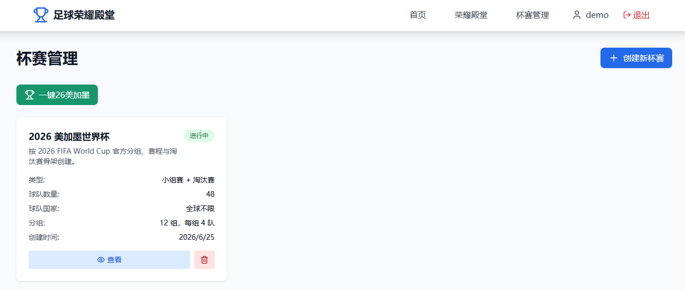
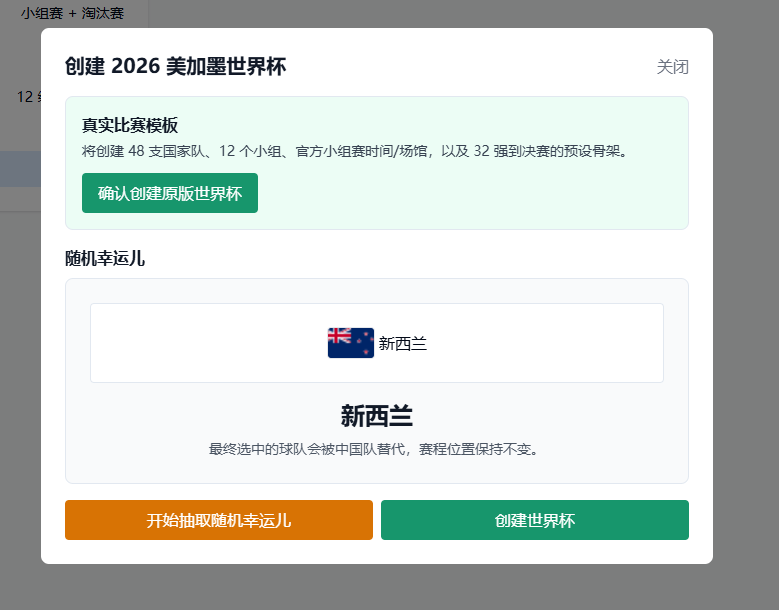
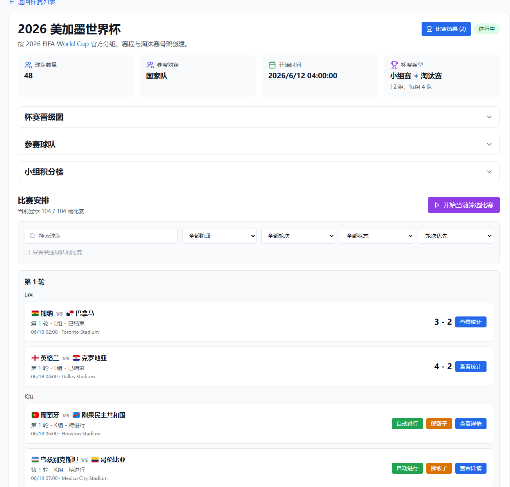
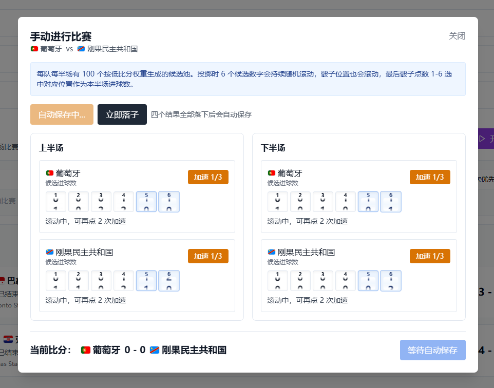

# Football Glory Hall

一个足球杯赛模拟与荣耀记录系统。支持创建俱乐部杯赛、国家队杯赛、真实赛事模板、自动模拟比赛、掷骰子手动比赛、晋级图和历史记录。

## 功能概览

- 用户注册、登录，支持邮箱或用户名登录。
- 管理员用户管理：启用/禁用、重置密码、软删除用户。
- 杯赛管理：淘汰赛、联赛、小组赛 + 淘汰赛。
- 创建杯赛时可选择俱乐部杯赛或国家队杯赛。
- 俱乐部杯赛支持真实俱乐部候选、队徽、国旗、国家筛选。
- 国家队杯赛使用离线静态国家列表，不实时抓取。
- 内置 2026 美加墨世界杯模板：
  - 一键创建 48 队真实赛事骨架。
  - 小组赛真实分组、赛程、场馆。
  - 32 强到决赛预设淘汰赛 slot 骨架。
  - 小组赛结束后自动解析 32 强球队。
  - 淘汰赛结束后自动解析下一轮胜者/败者 slot。
  - 支持“随机幸运儿”：抽中球队由中国队替代，赛程位置保持不变。
- 比赛安排支持按轮次、阶段/小组查看。
- 比赛可自动进行，也可用“掷骰子”小游戏手动生成结果。
- 淘汰赛平局自动进入点球大战。
- 小组积分榜、晋级图、球队列表默认折叠，可点击展开。
- 国旗和队徽图片走后端代理，提高国内访问稳定性。
- Docker Compose 部署，默认前端端口 `9300`。







## 技术栈

### 前端

- React 18
- TypeScript
- Vite
- Tailwind CSS
- React Router
- Axios

### 后端

- Node.js
- Express
- TypeScript
- TypeORM
- SQLite
- JWT
- bcryptjs

## 本地开发

### 安装依赖

```bash
npm install
cd server && npm install
cd ../client && npm install
```

### 环境变量

根目录可创建 `.env`：

```env
JWT_SECRET=change-this-secret
FOOTBALL_API_KEY=
FOOTBALL_API_URL=https://v3.football.api-sports.io
```

`FOOTBALL_API_KEY` 可选。没有 API key 时，系统仍可使用内置球队/国家队数据。

这两个 Football API 配置的作用：

- `FOOTBALL_API_KEY`：API-Football 的访问密钥，用于获取真实俱乐部球队、国家、队徽等数据。
- `FOOTBALL_API_URL`：API-Football 的接口地址，默认使用 `https://v3.football.api-sports.io`。

如果不配置 `FOOTBALL_API_KEY`：

- 俱乐部杯赛会使用项目内置的俱乐部候选数据。
- 部分俱乐部可能没有真实队徽。
- 国家队杯赛、UN 国家列表、2026 美加墨世界杯模板不依赖这个 API，仍然可以正常使用。

获取 `FOOTBALL_API_KEY`：

1. 打开 API-Football 官网：https://www.api-football.com/
2. 注册并登录账号。
3. 进入 Dashboard / API Keys 页面。
4. 复制平台分配的 API key。
5. 把 key 填入项目根目录 `.env`：

```env
FOOTBALL_API_KEY=你的API_KEY
FOOTBALL_API_URL=https://v3.football.api-sports.io
```

6. 重启后端或重新构建 Docker：

```bash
docker compose up -d --build
```

注意：不要把真实 API key 提交到 GitHub，`.env` 文件应保持在 `.gitignore` 中。

### 启动开发服务

```bash
npm run dev
```

默认地址：

- 前端：http://localhost:9300
- 后端：http://localhost:5005

也可以分别启动：

```bash
npm run client:dev
npm run server:dev
```

## Docker 部署

推荐服务器运行：

```bash
docker compose up -d --build
```

访问：

```text
http://服务器IP:9300
```

查看运行状态：

```bash
docker compose ps
docker compose logs -f
```

健康检查：

```bash
curl http://localhost:9300/api/health
```

## 常用命令

### 构建

```bash
npm run client:build
npm run server:build
```

### 查看 Git 状态

```bash
git status --short
```

### 推送到 GitHub

如果当前分支是 `master`：

```bash
git push -u origin master
```

如果要改成 `main`：

```bash
git branch -M main
git push -u origin main
```

## 默认端口

- 前端开发端口：`9300`
- Docker 前端端口：`9300`
- 后端端口：`5005`

## 数据说明

- SQLite 数据默认保存在 `server/data/database.sqlite`。
- `.env`、数据库文件、`node_modules`、构建产物已加入忽略，不应提交到 Git。
- 国家队国家列表是离线静态数据，口径为 UN 会员国 + 观察员国。
- 真实赛事模板是离线静态模板，不在运行时实时抓取。

## 主要页面

- 首页：根据登录状态跳转到注册/杯赛管理。
- 杯赛管理：创建杯赛、2026 世界杯模板、随机幸运儿、删除/启动/查看杯赛。
- 杯赛详情：参赛球队、小组积分榜、杯赛晋级图、比赛安排、比赛结果。
- 比赛详情：查看单场比赛状态、结果和统计。
- 管理员用户管理：管理员可管理系统用户。

## 备注

2026 美加墨世界杯模板中，普通比赛结果仍由本系统模拟或掷骰子生成；真实模板负责分组、赛程、场馆和淘汰赛骨架，不代表真实比赛结果。
